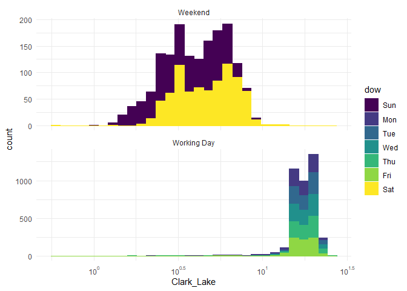

# Feature engineering

My summary of the [Feature Engineering book by Kuhn and
Johnson](https://www.feat.engineering/).

### Supervised and unsupervised learning

Supervised data analysis involves identifying patterns between
predictors and an identified outcome that is to be modeled or predicted,
while unsupervised techniques are focused solely on identifying patterns
among the predictors.

Exploratory data analysis is used to explore the data und uncover
potential challenges by examining the characteristics of the predictors
and the outcome variable as well as their relationships. This includes
their distribution, interaction, correlation and any peculiarities which
might make the modeling process challenging.

Predictive models are strictly supervised as we aim to find
relationships between the predictors and the outcome. Unsupervised
methods include cluster analysis, principal component analysis and
similar tools. While both approaches are prone to overfitting,
supervised learning is more inclined to finding erroneous patterns in
the data.

### The Modeling Process

The process of developing a model is iterative. It is not uncommon to
evaluate multiple and different approaches before a model is finalized.
The modeling process begins with exploratory data analysis, where data
is investigated. This might include simple summary statistics or
identifying relationships between the predictors and the outcome. This
process is iterative and includes repeated visualizations and analysis
until the data is thoroughly understood. At this point several different
modeling methods might be evaluated with the initial feature set.
However, each model might come with its own set of hyperparameters that
require tuning. Once these are tuned, each model is evaluated
numerically on the training data to assess its performance. Several
summary measures can be employed to understand the particular challenges
of the data. At this point more EDA can be conducted on the results
(e.g. on the identified misclassified cases). Following might be another
round of feature engineering that might be necessary to compensate these
challenges. At this point another round of model tuning on a limited
number of models can be conducted. These models can than be evaluated on
a new dataset to determine a final model.

### Bias vs. Variance

Variance describes how the data fluctuates when measured repeatedly. A
model has high variance if small changes to the data cause a sizable
change in the structure of the model. E.g. the sample mean has higher
variance than its median. Examples of models with inherently *low
variance* are *linear regression*, *logistic regression* and *partial
least squares*. Contrary, *high-variance* models are those that strongly
rely on single data points, such as *tree-based models*, *nearest
neighbor models*, and *neural networks*. Model bias describes the
flexibility of the model, i.e. its ability to generalize to unseen data.
Thus, a high-bias model will not be able to make good predictions on
data which distribution deviates from the data it has been trained on.
Linear models have a high bias since they cannot describe non-linear
patterns without further modifications.

The variance-bias trade-off is a common theme, as models with low bias
demonstrate high variance - and vice versa. In many cases, models have
parameters which allow to control how well they adjust to the data and
thus allow to control the bias and variance of the results. For example,
in a moving average model, which aims to predict temperature on a given
day by using the average of the day within a certain window, a small
moving window is more likely to be influenced by a single data point and
thus display high variance, but will pick up local trends in the data
(low bias). Using a bigger window would make the model less responsive
to trends in the data (lower variance) but will result in a less
sensitive model (high bias).

One way of achieving a low-variance, low-bias model, is to augment a
low-variance model with appropriate representations of the data to
decrease the bias. A linear model is linear *in the model parameters*,
but adding polynomials is a good way of adapting the model to non-linear
trends in the data. Similarly, feature selection techniques can
significantly improve model performance by eliminating unnecessary
predictors, which cause excess model variance.

### Experience-Driven Modeling and Empirically Driven Modeling

In many cases model performance can be improved by utilizing some kind
of model-based feature elimination. This approach can be dangerous as
data-driven approaches often tend to overfit the data. Additionally,
they may be overly complex and thus be difficult to explain and/or
rationalize. It is not uncommon for some conflicts between
experience-driven and data-driven approaches to arise. For example when
an unexpected, novel predictor, which shows strong relationship with the
outcome is identified. Subject matter experts may have more confidence
in the finding if the methods that are used to arrive at the discovery
are stringent enough.

Modeling insights to consider: - There is almost never a single model
fit or feature set that will immediately solve the problem. - The effect
of feature sets can be much larger than the effect of different
models. - The interplay between models and features is complex and
sometimes unpredictable. - With the right set of predictors, different
types of models can achieve comparable performance.

## Data Visualization

We will use the Chicago Transit Authority (CTA) “L” train system data to
predict ridership numbers for the Clark/Lake stop. For time series data,
predictors are often formed by lagging the data. For this application,
when predicting day D, predictors were created using the lag–14 data
from every station (e.g., ridership at day D−14). Other lags can also be
added to the model, if necessary.

### Visualizations for Numeric Data

Univariate visualizations are used to understand the distribution of a
single variable. A few common univariate visualizations are
box-and-whisker plots (i.e., box plot), violin plots, or histograms.

Because the foremost goal of modeling is to understand variation in the
response, the first step should be to understand the distribution of the
response. For a continuous response such as the ridership at the
Clark/Lake station, it is important to understand if the response has a
symmetric distribution, if the distribution has a decreasing frequency
of larger observations (i.e., the distribution is skewed), if the
distribution appears to be made up of two or more individual
distributions (i.e., the distribution has multiple peaks or modes), or
if there appears to be unusually low or high observations (i.e
outliers).

Understanding the distribution of the outcome provides valuable insights
about the expectations of model performance. If the model contains good
predictors then the residuals from this model should have less variation
than the variation of the outcome. Further, the distribution of the
outcome can tell us whether the outcome should be transformed. For
example, if the outcome follows a log-normal distribution then
log-transforming would project it into a normal distribution, which
often results in better model performance. Investigating the
distribution of the outcome also can provide clues about which variables
need to be included and/or how to transform them.

Let us look at the distribution of ridership from the Chicago dataset.
The boxplot below shows some summary statistics in the form of the
minimum , lower quartile, median, upper quartile and maximum value. For
a symmetric distribution the distances between the median and the
quartiles, as well as the whiskers would appear symmetric.

A drawback of the boxplot is that it does not show the density of the
data, i.e. whether a distribution has one or more peaks. From the
histogram (a) we can see two peaks, which the boxplot is unable to
capture. The violin plot (c) retains the information from the histogram.
Additionally, the same information as in the boxplot can be added to it.

When the predictors are on the same scale, we can plot them as
side-by-side boxplots of violin plots.

As the number of predictors grows, the ability to visualize the
individual distributions lessens and may be practically impossible. In
this situation, a subset of predictors that are thought to be important
can be examined using these techniques.

### Augmenting Visualizations through Facetting, Colors and Shapes

Facetting, colors and shapes are valuable tools for increasing
dimensionality of plots.

Following intuition we partition the Clark/Lake ridership by working
days/weekend. This distinction was not part of the original predictor
set but it clearly is useful in explaining the dual peak in the
distribution we saw before.

Still we can see data points which the distinction between working day
and weekend cannot explain, i.e. the long left tail of the working day
distribution. Finding a pattern, which explains the occurrence of these
points would improve the predictive model.

## Data Preprocessing

Knowing the characteristics of the data is a crucial step in the
modeling process. This encompasses variable distributions, missingness,
relationships between variables as well as with the outcome and so on.

### Numeric Predictors

There are many potential issues that can arise with predictors on a
continuous scale. Some can be mitigated by the choice of an appropriate
model. Tree-based models construct relationships between the outcome and
a numeric predictor based on the ranks of the values, not on the value
itself. These are also immune to outliers and/or skewed distributions.
Distance-based approaches like kNN or SVM are much more sensitive to
outliers as well as predictors being on different scales.

Another common problem with continuous predictors is multicollinearity.
Partial least squares is specifically designed to handle this problem,
while multiple linear regression and neural networks are highly
adversely affected.

The Box-Cox transformation was originally designed to transform the
dependent variable in order to fix violations of linear regression
assumptions like non-normality of residuals or heteroskedasticity.

$$
y𝛌 = \frac{y𝛌-1}{𝛌} 𝛌≠0
$$

$$
y𝛌 = log(𝛌) 𝛌=0
$$

This is a supervised transformation since it is applied to the outcome.
The transformation is estimated from the linear model residuals.

It was later adapted to scale predictors

$$
y𝛌 = \frac{y𝛌-1}{𝛌\bar{x}^{𝛌-1}} 𝛌≠0
$$

$$
y𝛌 = \bar{x}log(x) 𝛌=0
$$

where $\bar{x}$ is the geometric mean of the predictor and $𝛌$ is the
transformation parameter estimated form the predictor data.

This type of transformation is called **power transformation** because
the parameter is in the exponent. The Box-Cox transformation is very
flexible in its ability to handle different distributions. Based on the
value of $𝛌$ the transformation can be of different types:

log-transformation for $𝛌 = 0$

square-root transformation for $𝛌 = 0.5$

inverse for $𝛌 = -1$

The Box-Cox transformation results in an approximately symmetric
distribution but it can only be applied to strictly positive data. The
analogous Yeo-Johnson transformation can be applied to any numeric data.

Since these transformations, when applied to predictors, have no
relation to the outcome (and thus are *unsupervised*), they do not
guarantee that the model actually improves.

#### Logit-transformation

The logit-transformation is applied to variables which are bounded
between 0 and 1, such as proportions. This changes the scale from 0-1 to
values between negative and positive infinity. A smsll constant value
can be added to avoid dividing by zero, as for values close to 0 or 1.

The inverse logit transformation can be applied to bring the variable
values back to their original scale.

#### Scaling and Centering

Centering, i.e. substracting the mean or median (robust scaling) from
each individual value, is a common technique that - when applied to each
of the predictors - sets the mean of the predictors to be zero.

Scaling is the process of dividing each individual value of a predictor
by the standard deviation. This ensures that the variables standard
deviation becomes one.

Alternatively, range scaling uses a variables minimum and maximum values
to scale the data to a set interval (usually between zero and one).

These transformations are mild and needed for methods which require all
predictors to be on the same scale, like distance-based or
penalty-applying models (lasso/ridge).

Note that the statistics necessary for these transformations (mean,
median, sd, etc.) are estimated from the training data and applied to
test data and/or new data.

#### Moving Averages

Data smoothing, i.e. a running mean or median, can be applied to data
containing a **time or frequency effect.** A running mean of 5 would
replace each value with the mean of the value itself, the two values
before and the two values after it. The size of the moving window is
used to adjust the degree of smoothing.

Smoothing methods can be applied to any sequential predictor and/or
outcome data. It is important to make sure that the test set predictor
data are smoothed separately to avoid having the training set influence
values in the test set (or new unknown samples).

Predictors with a right-skewed distributions should be investigated
closely. While in some cases high values may simply be outliers and thus
removed from the dataset, in other cases the underlying distribution may
indeed be positively scaled, e.g. area in m². Skewness can be addressed
by a simple log-transformation or a more complicated Box-Cox (for
strictly positive) or Yeo-Johnson transformation, which scales the data
to a more uniform distribution.

Multicollinearity between predictors can be visually inspected by
plotting a correlation map. The correlation threshold is chosen at the
analysts discretion and may need to be lowered or raised depending on
the problem and the model.
